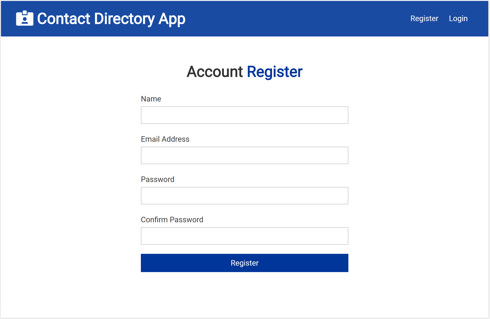
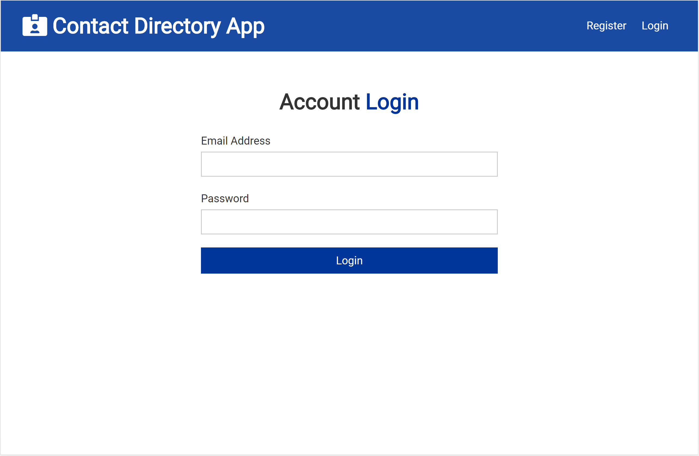
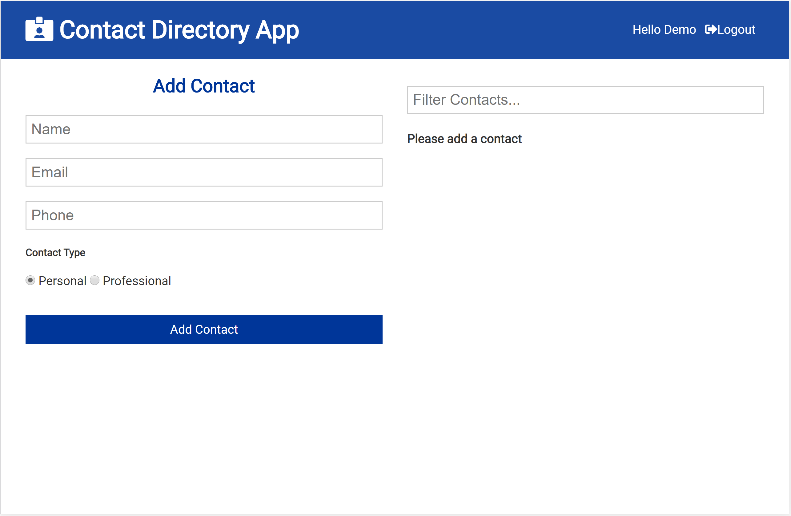
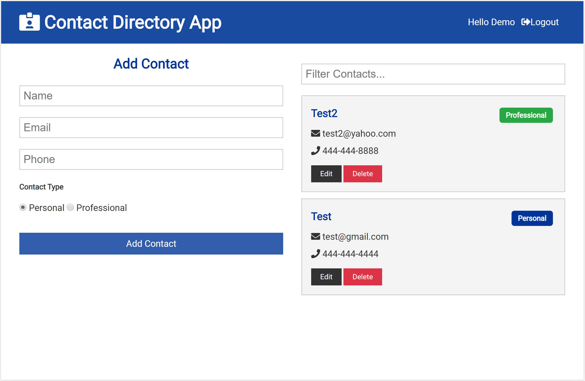

# Contact Directory App

### [Live demo](https://rocky-thicket-33616.herokuapp.com/login)

A full-stack application to save all your personal and professional contacts online and secure.

## Tech

Stack:

- React.js (Hooks, ContextAPI)
- Node.js/Express
- JWT
- MongoDB
- Mongoose

### Installations

1. Install dependencies with `npm install`
2. Run app on localhost:3000 with `npm run dev`

# Features

### Feature Overview

- Register/Login
- Add contacts

### Feature Description

- **Register/Login:** Users can register and login to their account.

  

  

  

- **Add contacts:** Users can add personal/professional contacts and filter by names.

  

- **Edit/Delete feature:** Users can update and delete the contact details.
